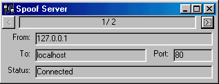



## A complete Internet Spoof Server\!

### Description

SpiderSpoof is a complete, multi-threading 'Spoof Server' for windows. A spoof server accepts telnet connections on a specified port and allows a connection through it to any other computer on the Internet (any computer that will accept the request). This allows you to:

a) Anonymise your Telnet/Mail/etc usage

b) Telnet/whatever to a remote server from inside a firewall.
 
### More Info
 
By default, SpiderSpoof listens on port 80 (open on most firewalls), but this can be changed by modifying the localport property of wsListen.

If there is sufficient demand, I can create a client that can route connections to the specified server without needing a modified mail programme/game/whatever.

             |
---                |---
**Submitted On**   |2000-04-09 12:57:48
**By**             |[Nick Johnson](https://github.com/Planet-Source-Code/PSCIndex/blob/master/ByAuthor/nick-johnson.md)
**Level**          |Advanced
**User Rating**    |4.4 (31 globes from 7 users)
**Compatibility**  |VB 5\.0, VB 6\.0
**Category**       |[Complete Applications](https://github.com/Planet-Source-Code/PSCIndex/blob/master/ByCategory/complete-applications__1-27.md)
**World**          |[Visual Basic](https://github.com/Planet-Source-Code/PSCIndex/blob/master/ByWorld/visual-basic.md)
**Archive File**   |[CODE\_UPLOAD51454242000\.zip](https://github.com/Planet-Source-Code/nick-johnson-a-complete-internet-spoof-server__1-7538/archive/master.zip)

